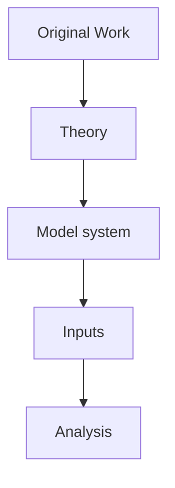

<h3>Overview</h3>

A tutorial to run simple surface binding calculations using Metadynamics through PLUMED. The procedure described herein is an extension of the [underlying work performed by Doudou <em>et al.</em>](https://pubmed.ncbi.nlm.nih.gov/26609600/) (1) where the binding free energy of a model binding system (and a benzamidine−trypsin system) are calculated from a one-dimenisona PMF and standardised to a reference point of a 1 M solution. A harmonic restraint is applied to the binding atom orthogonal to the collective variable used to describe the binding process. This has the effect of constraining the binding atom to a cylindrical volume orthogonal to the surface of interest. Equations 8 and 9 from the original paper demonstrate that the volume explored in the unbound region by the restrained binding atom can be analytically calculated and referenced to the standard-state volume, producing a volumed-based free energy correction to be applied to the total binding energy. 

While the original paper allows for the correction of a harmonic restraint with any spring constant, this method will only ever produce an upper limit for any free energy barriers separating the bound and unbound regions. Here we describe how to apply and account for a flat-bottomed harmonic cylindrical restraint instead of the normal harmonic restraint used in the original paper. The flat-bottomed restraint provides a region unperturbed by any harmonic potential, allowing for the possibity of producing the actual free energy profile, with accurate barrier heights, which could then be used for kinetic studies. Described [here](markdown/theory.md) are the integrals for the flat-bottomed potentials and a brief overview on how to turn the one-dimensional PMF into a standardised binding free energy.

<h3>System creation</h3>

For this tutorial, we have constructed a simple toy system that will run and converge quickly on any machine while still mimicking the important aspects of an actual binding profile. The details on how this has been done are presented [here](markdown/system.md).

<h3>Input files & running simulation</h3>

[OpenMM](https://github.com/openmm/openmm) (2) has been chosen as the molecular dynamics engine for this tutorial, utilising PLUMED through the [openmm-plumed plugin](https://github.com/openmm/openmm-plumed). Details on the provided input files, what they mean, and how to use them are discussed [here](markdown/inputs.md).

<h3>Analysing simulation</h3>

Using the plumed command line tool and a handful of Python and bash scripts, we demonstrate how to analyse the raw HILLS file produced by these simulations and produce the final standardised binding free energies. All details can be found [here](markdown/analysis.md).

<h3>References</h3>

1. Doudou S, Burton NA, Henchman RH. Standard free energy of binding from a one-dimensional potential of mean force. Journal of chemical theory and computation. 2009 Apr 14;5(4):909-18.
2. Eastman P, Galvelis R, Peláez RP, Abreu CR, Farr SE, Gallicchio E, Gorenko A, Henry MM, Hu F, Huang J, Krämer A. OpenMM 8: molecular dynamics simulation with machine learning potentials. The Journal of Physical Chemistry B. 2023 Dec 28;128(1):109-16.

