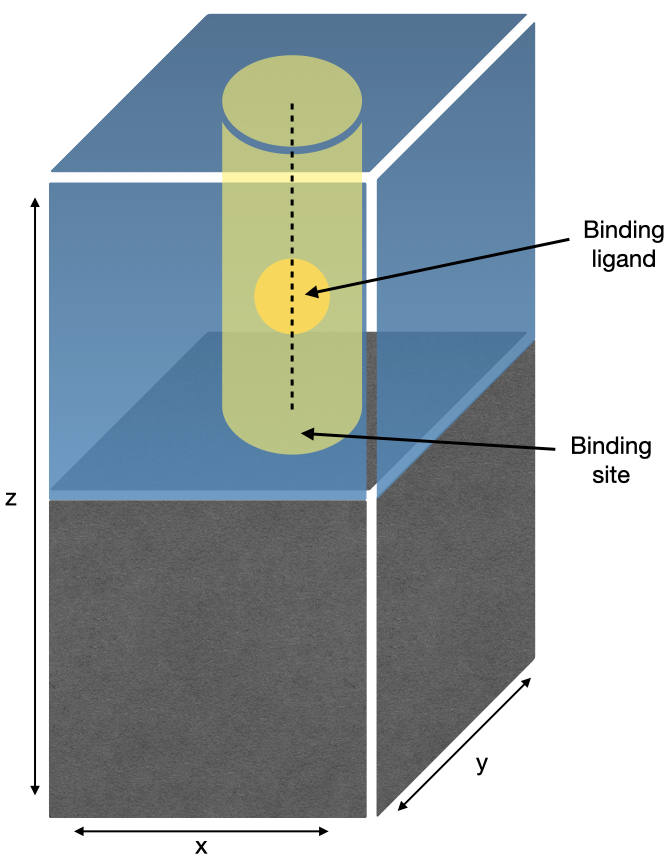
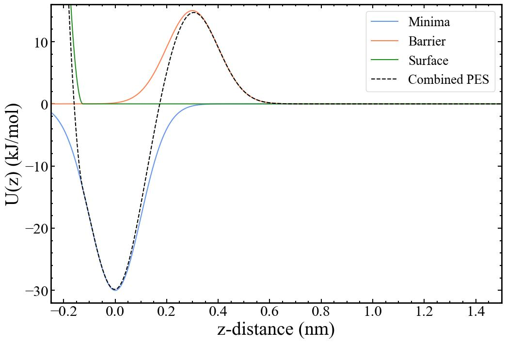

There are many situations where binding processes and their thermodynamics are important; with some of the more well-known examples including protein-ligand docking, interfacial chemistry and crystal growth. The model system described herein will aim to reproduce a typical simulation of crystal growth. Crystal growth is the process by which matter, typically in the form of ions and/or molecules will diffuse from solution and add to the surface of a crystal at the interface. The intricacies and details of this process will ultimately govern the shape and properties of the final crystal. Common examples include biomineralisation processes where organic impurities inhibit and modify the growth of ionic crystals; and the pharmaceutical industry where chemical modifiers are used to prevent the growth of needle-like crystals that are difficult to work with and have unfavourable properties.

Atomistic simulation of these processes can give us insight into how to exert highly specific control over crystals to produce materials with finely tuned properties. Obtaining free energy profiles of the binding process that are correct not only in the bound and unbound states, but also give free energy barriers of correct height is important in ultimately studying the kinetics of crystal growth. Accurate barrier heights will provide a good starting point for estimating kinetic processes and paving the way for larger-scale coarse-grained and Monte Carlo simulation methods.

This tutorial will take a simple system consisting of a surface in the xy-plane, with a binding ligand restrained along the z-direction, as shown below:

and construct a system containing one atom of Argon with a global potential energy surface aimed to reproduce the important parts of an actual surface-binding profile. Namely, one would expect there to be a minimum at the binding site, produced by attractive interactions between surface and adsorbate. Also, there would likely be a barrier between the binding site and solution, caused by overcoming the attractive forces with the surface, and by moving through any ordered and slow-to-diffuse solvent on the surface. Lastly, there needs to be a restraining potential acting on the binding ligand to mimic the effects of the surface itself, i.e., to prevent the binding ligand from moving into where the surface would be. The resulting potential energy surface looks as follows:

The details on how this is implemented in PLUMED is discussed in the [input files](inputs.md) section. We are avoiding simulating a binding process to an actual surface in the presence of a solvent in an attempt to produce a simple tutorial free of excessive and/or complicated files which can be performed on virtually any hardware at reasonable speeds. All of the underlying principles remain the same. 

---

[Back to binding tutorial main page.](../README.md)